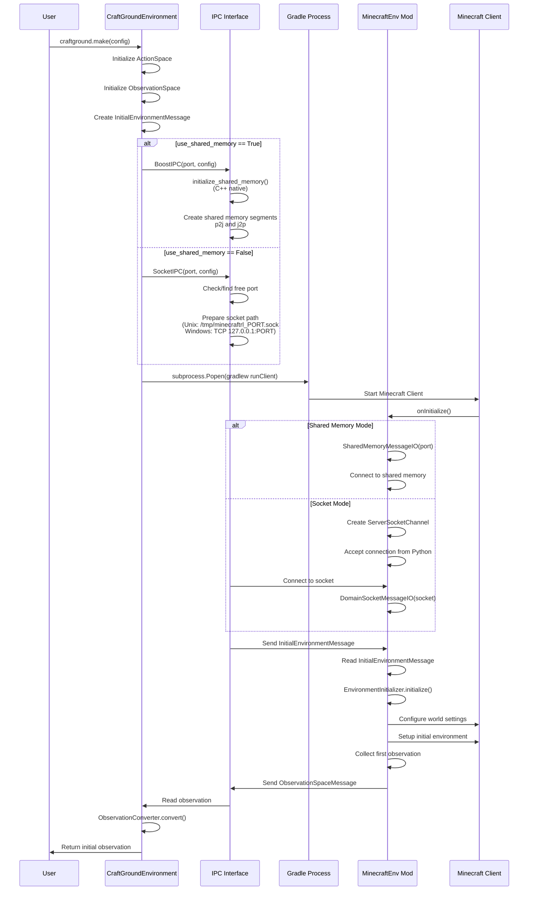
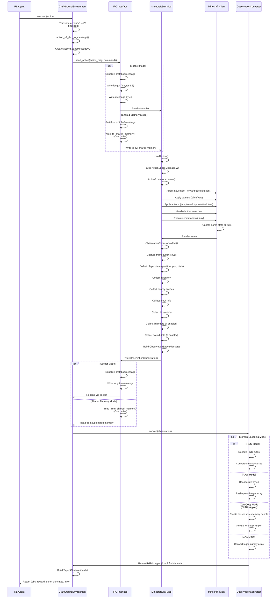
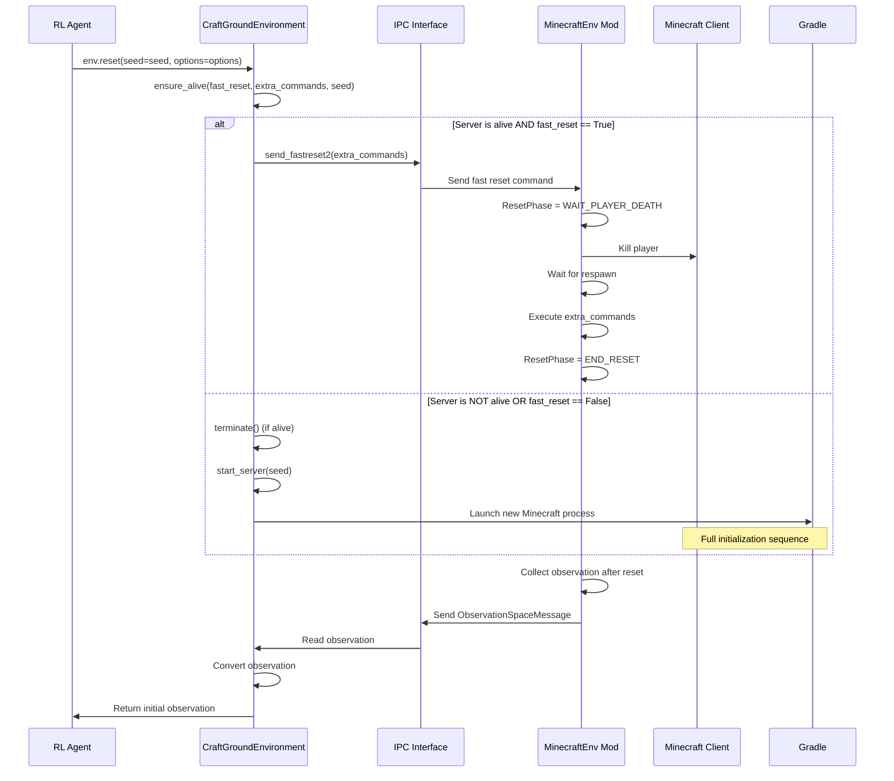
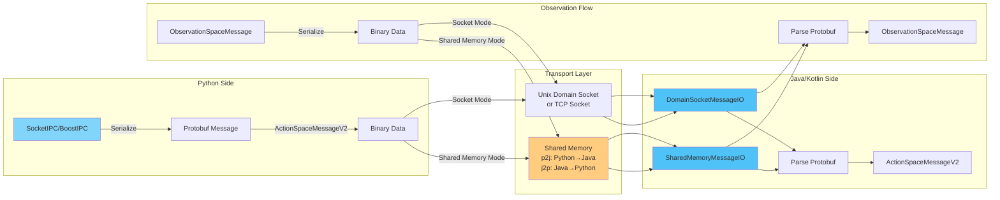
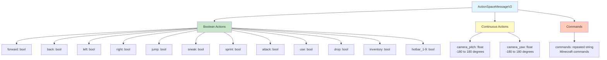
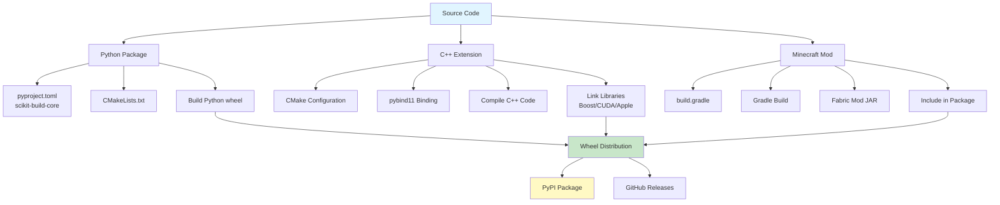
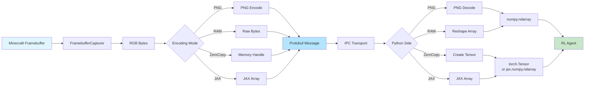

# CraftGround 아키텍처 플로우차트

이 문서는 CraftGround 레포지토리의 구성요소와 데이터 흐름을 매우 자세히 나타낸 플로우차트입니다.

## 전체 시스템 아키텍처

```mermaid
graph TB
    subgraph "Python Layer (RL Agent)"
        A[User Code] -->|craftground.make()| B[CraftGroundEnvironment]
        B -->|Gymnasium API| C[RL Framework<br/>Stable-Baselines3/RLlib/etc]
    end
    
    subgraph "Python Environment Layer"
        B --> D[InitialEnvironmentConfig]
        B --> E[ActionSpaceVersion]
        B --> F[IPC Interface]
        F -->|Socket Mode| G[SocketIPC]
        F -->|Shared Memory Mode| H[BoostIPC]
        B --> I[ObservationConverter]
        B --> J[CsvLogger]
    end
    
    subgraph "IPC Communication Layer"
        G -->|Unix Domain Socket<br/>/tmp/minecraftrl_PORT.sock| K[DomainSocketMessageIO]
        G -->|TCP Socket<br/>127.0.0.1:PORT| K
        H -->|Shared Memory<br/>craftground_PORT_p2j/j2p| L[SharedMemoryMessageIO]
        H -->|C++ Native| M[ipc_boost.cpp<br/>ipc_cuda.cpp<br/>ipc_apple.mm]
    end
    
    subgraph "Protocol Buffers"
        N[action_space.proto] --> O[ActionSpaceMessageV2]
        P[observation_space.proto] --> Q[ObservationSpaceMessage]
        R[initial_environment.proto] --> S[InitialEnvironmentMessage]
    end
    
    subgraph "Minecraft Mod Layer (Java/Kotlin)"
        K --> T[MinecraftEnv Mod]
        L --> T
        T --> U[MessageIO Interface]
        T --> V[EnvironmentInitializer]
        T --> W[FramebufferCapturer]
        T --> X[ObservationCollector]
        T --> Y[ActionExecutor]
        T --> Z[TickSynchronizer]
    end
    
    subgraph "Minecraft Game Engine"
        T --> AA[Minecraft Client<br/>Fabric Mod Loader]
        AA --> BB[Minecraft 1.21.0]
        BB --> CC[World Rendering]
        BB --> DD[Entity Management]
        BB --> EE[Block System]
    end
    
    style A fill:#e1f5ff
    style B fill:#b3e5fc
    style F fill:#81d4fa
    style T fill:#4fc3f7
    style AA fill:#29b6f6
```

## 초기화 플로우



## Step 액션 플로우



## Reset 플로우



## IPC 통신 상세 구조



## 관찰 공간 (Observation Space) 구조

```mermaid
graph TB
    A[ObservationSpaceMessage] --> B[Image Data]
    A --> C[Player State]
    A --> D[Inventory]
    A --> E[Entities]
    A --> F[Blocks]
    A --> G[Biomes]
    A --> H[Lidar]
    A --> I[Sound]
    
    B --> B1[image: bytes<br/>PNG or RAW]
    B --> B2[image_2: bytes<br/>Binocular mode]
    B --> B3[depth: bytes<br/>If requiresDepth]
    
    C --> C1[x, y, z: float<br/>Position]
    C --> C2[yaw, pitch: float<br/>Camera angles]
    C --> C3[health, food: float]
    C --> C4[isAlive: bool]
    
    D --> D1[inventory: repeated Item]
    D --> D2[mainHand: int]
    
    E --> E1[entitiesWithinDistance:<br/>repeated EntityInfo]
    
    F --> F1[blockInfo:<br/>repeated BlockInfo]
    F --> F2[heightInfo:<br/>repeated HeightInfo]
    
    G --> G1[biomeInfo:<br/>repeated BiomeInfo]
    G --> G2[nearbyBiome:<br/>repeated NearbyBiome]
    
    H --> H1[lidarResult:<br/>LidarResult]
    
    I --> I1[soundData: bytes]
    
    style A fill:#e1f5ff
    style B fill:#b3e5fc
    style C fill:#81d4fa
```



## 액션 공간 (Action Space) 구조



## 환경 초기화 설정 구조

```mermaid
graph TB
    A[InitialEnvironmentConfig] --> B[World Settings]
    A --> C[Image Settings]
    A --> D[Player Settings]
    A --> E[Feature Settings]
    A --> F[Structure Settings]
    
    B --> B1[isWorldFlat: bool]
    B --> B2[worldType: string]
    B --> B3[seed: int]
    B --> B4[timeOfDay: int]
    B --> B5[weather: string]
    
    C --> C1[imageSizeX: int]
    C --> C2[imageSizeY: int]
    C --> C3[screen_encoding_mode:<br/>PNG/RAW/ZEROCOPY/JAX]
    C --> C4[eye_distance: float<br/>Binocular mode]
    
    D --> D1[spawnX, Y, Z: float]
    D --> D2[spawnYaw, Pitch: float]
    D --> D3[gameMode: string]
    
    E --> E1[lidarConfig: LidarConfig]
    E --> E2[soundConfig: SoundConfig]
    E --> E3[requiresDepth: bool]
    E --> E4[blockCollisionKeys: list]
    E --> E5[entityCollisionKeys: list]
    
    F --> F1[structures: repeated Structure]
    F --> F2[items: repeated Item]
    F --> F3[entities: repeated Entity]
    
    style A fill:#e1f5ff
    style B fill:#c8e6c9
    style C fill:#fff9c4
    style D fill:#ffccbc
    style E fill:#e1bee7
    style F fill:#b2dfdb
```



## 컴포넌트 상세 구조

```mermaid
graph TB
    subgraph "Python Package Structure"
        A[craftground/] --> B[__init__.py<br/>make function]
        A --> C[environment/]
        A --> D[environments/]
        A --> E[proto/]
        A --> F[wrappers/]
        A --> G[nbt/]
        A --> H[MinecraftEnv/]
        
        C --> C1[environment.py<br/>CraftGroundEnvironment]
        C --> C2[action_space.py<br/>Action definitions]
        C --> C3[observation_space.py<br/>Observation definitions]
        C --> C4[socket_ipc.py<br/>Socket IPC]
        C --> C5[boost_ipc.py<br/>Shared memory IPC]
        C --> C6[observation_converter.py<br/>Image conversion]
        C --> C7[ipc_interface.py<br/>IPC interface]
        
        D --> D1[base_environment.py]
        D --> D2[find_village_environment.py]
        D --> D3[husk_environment.py]
        D --> D4[... other environments]
        
        E --> E1[action_space_pb2.py]
        E --> E2[observation_space_pb2.py]
        E --> E3[initial_environment_pb2.py]
        
        F --> F1[sb3_environment.py<br/>Stable-Baselines3 wrapper]
        F --> F2[fast_reset.py]
        F --> F3[bimodal.py]
        F --> F4[sound.py]
        F --> F5[vision.py]
    end
    
    subgraph "C++ Native Code"
        I[src/cpp/] --> I1[ipc.cpp<br/>Base IPC functions]
        I --> I2[ipc_boost.cpp<br/>Boost shared memory]
        I --> I3[ipc_cuda.cpp<br/>CUDA support]
        I --> I4[ipc_apple.mm<br/>Apple Metal support]
        I --> I5[ipc.h<br/>Header file]
    end
    
    subgraph "Minecraft Mod Structure"
        H --> H1[src/main/java/]
        H1 --> H2[MinecraftEnv.kt<br/>Main mod class]
        H1 --> H3[MessageIO.kt<br/>IPC interface]
        H1 --> H4[EnvironmentInitializer.kt]
        H1 --> H5[FramebufferCapturer.kt]
        H1 --> H6[ObservationCollector.kt]
        H1 --> H7[ActionExecutor.kt]
        H1 --> H8[TickSynchronizer.kt]
        H1 --> H9[proto/<br/>Protobuf definitions]
    end
    
    style A fill:#e1f5ff
    style I fill:#fff9c4
    style H fill:#c8e6c9
```



## 빌드 및 배포 플로우



## 데이터 변환 파이프라인



이 플로우차트는 CraftGround의 전체 아키텍처와 데이터 흐름을 상세히 보여줍니다. 각 컴포넌트의 역할과 상호작용을 이해하는 데 도움이 됩니다.
