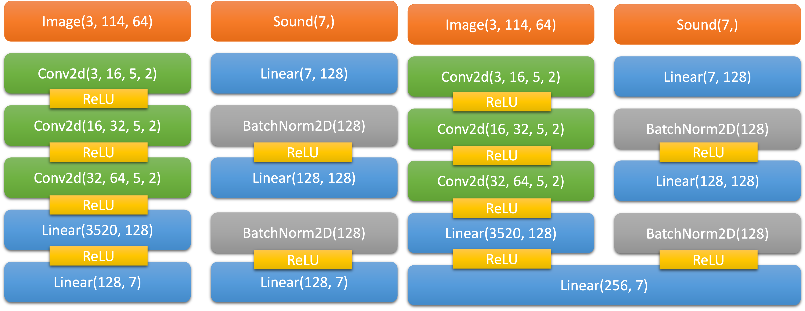

# CraftGround - Reinforcement Learning Environment for Minecraft

[](https://github.com/yhs0602/MinecraftRL)

RL experiments using lightweight minecraft environment

## Quick start

1. You need to install JDK >= 17
1. Run the following command to install the package.
    ```shell
    pip install git+https://github.com/yhs0602/CraftGround
    ```
1. Take a look at the [the demo repository](https://github.com/yhs0602/CraftGround-Baselines3)!
1. Here is a simple example that uses this environment.
    ```python
   from craftground import craftground
   from craftground.wrappers.action import ActionWrapper, Action
   from craftground.wrappers.fast_reset import FastResetWrapper
   from craftground.wrappers.time_limit import TimeLimitWrapper
   from craftground.wrappers.vision import VisionWrapper
   from stable_baselines3 import A2C
   from stable_baselines3.common.monitor import Monitor
   from stable_baselines3.common.vec_env import VecVideoRecorder, DummyVecEnv
   from wandb.integration.sb3 import WandbCallback
   
   import wandb
   from avoid_damage import AvoidDamageWrapper
   
   
   def main():
       run = wandb.init(
           # set the wandb project where this run will be logged
           project="craftground-sb3",
           entity="jourhyang123",
           # track hyperparameters and run metadata
           group="escape-husk",
           sync_tensorboard=True,  # auto-upload sb3's tensorboard metrics
           monitor_gym=True,  # auto-upload the videos of agents playing the game
           save_code=True,  # optional    save_code=True,  # optional
       )
       env = craftground.make(
           # env_path="../minecraft_env",
           port=8023,
           initialInventoryCommands=[],
           initialPosition=None,  # nullable
           initialMobsCommands=[
               "minecraft:husk ~ ~ ~5 {HandItems:[{Count:1,id:iron_shovel},{}]}",
               # player looks at south (positive Z) when spawn
           ],
           imageSizeX=114,
           imageSizeY=64,
           visibleSizeX=114,
           visibleSizeY=64,
           seed=12345,  # nullable
           allowMobSpawn=False,
           alwaysDay=True,
           alwaysNight=False,
           initialWeather="clear",  # nullable
           isHardCore=False,
           isWorldFlat=True,  # superflat world
           obs_keys=["sound_subtitles"],
           initialExtraCommands=[],
           isHudHidden=False,
           render_action=True,
           render_distance=2,
           simulation_distance=5,
       )
       env = FastResetWrapper(
           TimeLimitWrapper(
               ActionWrapper(
                   AvoidDamageWrapper(VisionWrapper(env, x_dim=114, y_dim=64)),
                   enabled_actions=[Action.FORWARD, Action.BACKWARD],
               ),
               max_timesteps=400,
           )
       )
       env = Monitor(env)
       env = DummyVecEnv([lambda: env])
       env = VecVideoRecorder(
           env,
           f"videos/{run.id}",
           record_video_trigger=lambda x: x % 2000 == 0,
           video_length=200,
       )
       model = A2C(
           "MlpPolicy", env, verbose=1, device="mps", tensorboard_log=f"runs/{run.id}"
       )
   
       model.learn(
           total_timesteps=10000,
           callback=WandbCallback(
               gradient_save_freq=100,
               model_save_path=f"models/{run.id}",
               verbose=2,
           ),
       )
       model.save("a2c_craftground")
       run.finish()
   
       # vec_env = model.get_env()
       # obs = vec_env.reset()
       # for i in range(1000):
       #     action, _state = model.predict(obs, deterministic=True)
       #     obs, reward, done, info = vec_env.step(action)
       #     # vec_env.render("human")
       #     # VecEnv resets automatically
       #     # if done:
       #     #   obs = vec_env.reset()
   
   
   if __name__ == "__main__":
       main()

    ```

# Environment

https://github.com/yhs0602/MinecraftEnv

Utilizing protocol buffers, we've constructed a reinforcement learning environment specifically tailored for Minecraft.
Below are detailed specifications of the environment's architecture:

## Initial Environment

### `BlockState`

| Field       | Type   | Description                                                                                                      |
|-------------|--------|------------------------------------------------------------------------------------------------------------------|
| x, y, z     | int32  | Coordinates of the block.                                                                                        |
| block_state | string | State of the block, e.g., `minecraft:andesite_stairs[facing=east,half=bottom,shape=straight,waterlogged=false]`. |

### `InitialEnvironmentMessage`

| Field                                       | Type                | Description                                   |
|---------------------------------------------|---------------------|-----------------------------------------------|
| initialInventoryCommands                    | repeated string     | Commands to setup initial inventory.          |
| initialPosition                             | repeated int32      | Player's starting coordinates.                |
| initialMobsCommands                         | repeated string     | Commands for spawning mobs.                   |
| imageSizeX, imageSizeY                      | int32               | Image dimensions of the environment.          |
| seed                                        | int64               | World generation seed.                        |
| allowMobSpawn                               | bool                | Controls mob spawning.                        |
| alwaysNight, alwaysDay                      | bool                | Control for time of day.                      |
| initialWeather                              | string              | Initial weather setting.                      |
| isWorldFlat                                 | bool                | Flat world toggle.                            |
| visibleSizeX, visibleSizeY                  | int32               | Player's visible dimensions.                  |
| initialExtraCommands                        | repeated string     | Extra commands for initialization.            |
| killedStatKeys, minedStatKeys, miscStatKeys | repeated string     | Player's statistic keys.                      |
| initialBlockStates                          | repeated BlockState | Initial world block states.                   |
| surroundingEntityDistances                  | repeated int32      | Entity distances from player.                 |
| hudHidden                                   | bool                | Toggle for HUD visibility.                    |
| render_distance, simulation_distance        | int32               | Block and entity render/simulation distances. |

## Observation Space

### `ItemStack`

| Field                      | Type   | Description                          |
|----------------------------|--------|--------------------------------------|
| raw_id                     | int32  | Unique item identifier.              |
| translation_key            | string | Item's display name translation key. |
| count                      | int32  | Amount in the item stack.            |
| durability, max_durability | int32  | Durability information of item.      |

### `BlockInfo`

| Field           | Type   | Description                           |
|-----------------|--------|---------------------------------------|
| x, y, z         | int32  | Block coordinates.                    |
| translation_key | string | Block's display name translation key. |

### `EntityInfo`

| Field           | Type   | Description                  |
|-----------------|--------|------------------------------|
| unique_name     | string | Unique name of the entity.   |
| translation_key | string | Entity's translation key.    |
| x, y, z         | double | Entity coordinates.          |
| yaw, pitch      | double | Yaw and Pitch of the entity. |
| health          | double | Health of the entity.        |

### `ObservationSpaceMessage`

| Field                | Type                               | Description                                                |
|----------------------|------------------------------------|------------------------------------------------------------|
| image                | bytes                              | Image data of the environment.                             |
| x, y, z              | double                             | Player's coordinates in the world.                         |
| yaw, pitch           | double                             | Player's orientation (yaw & pitch).                        |
| health               | double                             | Player's health level.                                     |
| food_level           | double                             | Player's food level.                                       |
| saturation_level     | double                             | Player's saturation level.                                 |
| is_dead              | bool                               | Flag indicating if the player is dead.                     |
| inventory            | repeated ItemStack                 | List of items in player's inventory.                       |
| raycast_result       | HitResult                          | Raycasting result to identify targeted blocks or entities. |
| sound_subtitles      | repeated SoundEntry                | List of recent sounds with subtitles.                      |
| status_effects       | repeated StatusEffect              | List of active status effects on the player.               |
| killed_statistics    | map<string, int32>                 | Player's kill statistics with entity names as keys.        |
| mined_statistics     | map<string, int32>                 | Player's block mining statistics with block types as keys. |
| misc_statistics      | map<string, int32>                 | Miscellaneous statistics.                                  |
| visible_entities     | repeated EntityInfo                | List of entities currently visible to the player.          |
| surrounding_entities | map<int32, EntitiesWithinDistance> | Map of entities around the player with distances as keys.  |
| bobber_thrown        | bool                               | Flag indicating if a fishing bobber is currently thrown.   |
| world_time           | int64                              | Current world time.                                        |
| last_death_message   | string                             | Last death reason.                                         |

## Action Space

### `ActionSpaceMessage`

| Field    | Type            | Description               |
|----------|-----------------|---------------------------|
| action   | repeated int32  | Available player actions. |
| commands | repeated string | Any minecraft commands.   |

# Experiments

Please see [final_experiments](https://github.com/yhs0602/MinecraftRL/tree/main/code/experiments) to see various
settings for the experiments.

# Tasks

- Escape a husk in a superflat world using sound information
- Escape three husks in a superflat world using sound information
- Escape a warden in a superflat world using sound information
- Escape a husk in a superflat world using visual information
- Escape three husks in a superflat world using visual information
- Fish in a normal world
- Find a village in a normal world using flying
- Fish using an enchanted fishing rod

# Models

- DQN, Double DQN, Dueling DQN
    - CNN (stride = 2, kernel_size=5)
    - Fully Connected Network (hidden_dim = 128)
- Dueling DRQN
- A2C
- TODO: PPO, SAC, DDPG etc

# Encoding

- Vision: 3 channels, w, h rgb array
- Audio: `[Dx, Dz, [Dy]] * number of sounds, player hit sound, cos(yaw), sin(yaw)`
- Token: 0 to 1 float32 array, defined by the user

# Example Model Figures (DQN)



# Experiments

## How to make an environment

First, there are some concepts you need to know to create a custom experiment.

1. Environment: The environment that the agent interacts with. You may choose one
   from [environments](https://github.com/yhs0602/MinecraftRL/tree/main/code/environments).
   The environment need a name and params to be created.
2. Wrapper: The wrapper helps you to connect your models, algorithms to the environment. It provides custom rewards, or
   observation space conversion.
3. Algorithm: It runs the training and test loops, and log the results. As the algorithm is tightly coupled with the
   model, you may need to implement your own algorithm to use your custom model.

To create a custom experiment, you need to create a new file in `code/experiments` directory. The file name should be
`{your_experiment_name}.yml`. Then, you need to specify the following specs. The specific specs may vary depending on
the algorithm you use.

```yaml
seed: null # The seed to generate the world. If null, the seed will be randomly generated.
env_path: null # The path to the MinecraftEnv project. If null, it will use the default path.
group: jsrl_fish # The name of the group of the experiment. The experiments will be grouped by this name in the wandb console.
record_video: true # Whether to record the video of the experiment.
device: null # The device to run the experiment. If null, it will use the default device.

env: # The environment to run the experiment in.
  name: # The name of the pre-defined environment. You can choose one from the list in environments.py
    params: # The parameters to create the environment. You can see the parameters in environments.py
      hud: true # Whether to show the HUD in the environment.
      verbose: false # Whether to show the verbose information in the environment.
      port: 8000 # Via which port the environment will communicate with this agent.
      render_action: true # Whether to include the agent's action in the video.
      size_x: 256 # The size of the screen in x axis.
      size_y: 256 # The size of the screen in y axis.

wrappers: # The wrappers that wraps the environment. It is an array of wrappers that will be applied in order.
  - name: 'ActionWrapper' # The convenience wrapper for the discrete actions.
    enabled_actions: # The specific actions that are enabled by this wrapper.
      - NO_OP # No operation action.
      - USE # Use action.

  - name: 'SoundWrapper' # The wrapper that adds sound-based features to the environment.
    coord_dim: 2 # The dimension of sound coordinates.
  - name: 'FishCodWrapper' # Additional wrapper for fishing reward.

algorithm: # Details of the algorithm to be used.
  name: "SoundJSRLDQNAlgorithm" # The specific name of the algorithm.
  params: # Parameters for the algorithm.
    num_episodes: 1000 # Total number of episodes to run.
    warmup_episodes: 10 # Episodes before starting the main training.
    steps_per_episode: 400 # Steps to be taken per episode.
    test_frequency: 10 # Frequency of tests during the episodes.
    solved_criterion: # Criterion to determine if the environment is solved.
      name: 'ScoreCriterion'
      params:
        min_episode: 100
        min_avg_score: 195
        min_test_score: 195
        min_avg_test_score: 195
  hidden_dim: 128 # Dimension of the hidden layers.
  epsilon_init: 1.0 # Initial value of epsilon for the epsilon-greedy policy.
  epsilon_decay: 0.99 # Decay rate of epsilon.
  epsilon_min: 0.01 # Minimum value of epsilon.
  update_frequency: 1000 # Frequency of updates.
  train_frequency: 1 # Training frequency.
  replay_buffer_size: 1000000 # Size of the replay buffer.
  batch_size: 256 # Batch size for training.
  gamma: 0.99 # Discount factor.
  learning_rate: 0.00001 # Learning rate for the optimizer.
  weight_decay: 0.00001 # Weight decay for regularization.
  tau: 1.0 # Target network update rate.
  guide_policy: # Policy that guides the agent.
    name: 'FishingGuide'
    params:
      min_episode: 100
  decrease_guide_step_threshold: 0.5 # Threshold for decreasing guide steps.
```

# Environment list

See [code/environments](https://github.com/yhs0602/MinecraftRL/tree/main/code/environments) for the implementations of
the environments.

| Env name              | Description                                                                   |
|-----------------------|-------------------------------------------------------------------------------|
| husk                  | Escaping from a single husk in a superflat world. The husk position is fixed. |
| husks                 | Escaping from multiple husks in a superflat world. The positions are fixed.   |
| husk-noisy            | Escaping from a husk, with many other animals.                                |
| husks-noisy           | Escaping from husks, with many other animals                                  |
| husk-darkness         | Escaping from a husk, with darkness effect                                    |
| husks-darkness        | Escaping from husks, with darkness effect                                     |
| find-animal           | Searching for randomly arranged animals in a animal pen                       |
| husk-random           | Escaping from a randomly positioned husk.                                     |
| husks-random          | Escaping from randomly positioned husks.                                      |
| husks-random-darkness | Escaping from randomly positioned husks with darkness effect applied          |
| husks-continuous      | Husks are summoned nearby the player continuously                             |
| husk-random-terrain   | Escape from a husk, in a normal terrain                                       |
| husk-random-forest    | Escape from a husk, in a forest                                               |
| husk-hunt             | Hunting a husk in a superflat world using a diamond sword.                    |
| mansion               | Escaping from a mansion                                                       |
| skeleton-random       | Escaping from a skeleton                                                      |
| find-village          | Searching for a village                                                       |
| flat-night            | Escaping from every threats in a superflat world at night                     |
| fishing               | Fish a cod on a beach                                                         |

# Wrapper list

| Wrapper Name            | Description                                                                                         |
|-------------------------|-----------------------------------------------------------------------------------------------------|
| CleanUpFastResetWrapper | A wrapper for fast environment resetting, every wrappers should inherit this.                       |
| action                  | Defines discrete action spaces and operations for the agent.                                        |
| continuous_action       | Enables the agent to take actions in a continuous action space.                                     |
| fly_helper              | Assists the agent in flying operations within the environment.                                      |
| mineclip                | Allows the agent to use [MineCLIP](https://github.com/MineDojo/MineCLIP/tree/main/mineclip) reward. |
| surrounding_sound       | Adds auditory feedback from the environment, indicating surrounding entities.                       |
| attack_kill             | Enables the agent to execute attack and eliminate operations.                                       |
| avoid_damage            | Helps the agent in strategies to prevent or minimize damage.                                        |
| bimodal                 | Provides vision and audio input for the agent.                                                      |
| find_animal             | Assists the agent in locating specific animals in the environment.                                  |
| find_village            | Aids the agent in discovering villages within the environment.                                      |
| fish_cod                | Enables the agent to perform fishing operations.                                                    |
| go_up                   | Assists the agent in upward movement or climbing actions.                                           |
| go_up_2                 | An extended version or variant of `go_up`, offering more functionalities.                           |
| jump_helper             | Aids the agent in performing jumping actions correctly.                                             |
| simple_navigation       | Provides basic navigation functionalities for the agent.                                            |
| simplest_navigation     | A more streamlined version of `simple_navigation` with minimal functionalities.                     |
| sound                   | Provides sound-based feedback or actions for the agent.                                             |
| survival                | Enables survival strategies and behaviors for the agent.                                            |
| terminate_on_death      | Ends the episode or session upon the agent's death.                                                 |
| vision                  | Incorporates visual feedback or vision-based actions for the agent.                                 |
| reward_token_change     | Provides token-based rewards for the agent.                                                         |
| token_providers         | Provides the tokens for the agent.                                                                  |
| bimodal_token           | Provides bimodal observation and the tokens for the agent.                                          |

# Algorithm list

| Algorithm Name | Description                                                                                                                                 |
|----------------|---------------------------------------------------------------------------------------------------------------------------------------------|
| a2c            | Advantage Actor-Critic algorithm for policy and value function approximation.                                                               |
| bimodal_dqn    | DQN variant designed for environments with bimodal observation space.                                                                       |
| dqn            | Deep Q-Network algorithm for Q-value approximation using deep neural networks.                                                              |
| epsilon_greedy | A simple exploration strategy using epsilon probability for random actions.                                                                 |
| jsrl_dqn       | Custom DQN variant base specifically tailored for [JSRL(Jump Start Reinforcement Learning)](https://arxiv.org/abs/2204.02372) environments. |
| sound_a2c      | A2C algorithm with sound-based inputs or feedback.                                                                                          |
| sound_dqn      | DQN variant that utilizes sound-based observations.                                                                                         |
| sound_drqn     | Deep Recurrent Q-Network with sound inputs for environments with temporal dependencies.                                                     |
| sound_jsrl_dqn | Custom JSRL DQN variant leveraging sound-based observations.                                                                                |
| vision_a2c     | A2C algorithm with visual-based inputs or feedback.                                                                                         |
| vision_dqn     | DQN variant that utilizes visual observations.                                                                                              |
| vision_drqn    | Deep Recurrent Q-Network with visual inputs for environments with temporal dependencies.                                                    |
| bimodal_a2c    | A2C variant designed for environments with bimodal observations.                                                                            |
| bimodal_drqn   | DRQN variant for environments with bimodal observations.                                                                                    |
| drqn           | Deep Recurrent Q-Network for environments with temporal dependencies.                                                                       |

# Models

| Model Name                    | Description                                                                                      |
|-------------------------------|--------------------------------------------------------------------------------------------------|
| dqn                           | Basic Deep Q-Network model for value function approximation.                                     |
| dueling_bimodal_attention_dqn | Dueling DQN with attention mechanism for bimodal inputs.                                         |
| dueling_bimodal_dqn           | Dueling DQN architecture for environments with bimodal observations.                             |
| dueling_sound_dqn             | Dueling DQN model that utilizes sound-based observations.                                        |
| dueling_sound_drqn            | Dueling Deep Recurrent Q-Network with sound inputs for environments with temporal dependencies.  |
| dueling_vision_dqn            | Dueling DQN model that utilizes visual observations.                                             |
| dueling_vision_drqn           | Dueling Deep Recurrent Q-Network with visual inputs for environments with temporal dependencies. |
| per                           | Prioritized Experience Replay mechanism to weigh experiences based on their TD-error.            |
| ppo                           | Proximal Policy Optimization, a policy gradient method for reinforcement learning.               |
| recurrent_replay_buffer       | Replay buffer designed for recurrent models to store sequences of experiences.                   |
| replay_buffer                 | Basic replay buffer to store and sample experiences.                                             |
| sound_a2c                     | Advantage Actor-Critic model tailored for sound-based observations.                              |
| vision_a2c                    | Advantage Actor-Critic model tailored for visual observations.                                   |
| bimodal_a2c                   | A2C model designed for environments with bimodal observations.                                   |
| bimodal_replay_buffer         | Replay buffer tailored for environments with bimodal observations.                               |
| sumtree                       | Data structure for efficient computation in prioritized experience replay.                       |
| transition                    | Data structure or method for representing state transitions in the environment.                  |
| bimodal_token_replay_buffer   | Replay buffer for bimodal observation with tokens.                                               |
| dueling_bimodal_token_dqn     | Dueling DQN model for bimodal observation with tokens.                                           |

# Devaju font license

https://dejavu-fonts.github.io/License.html


