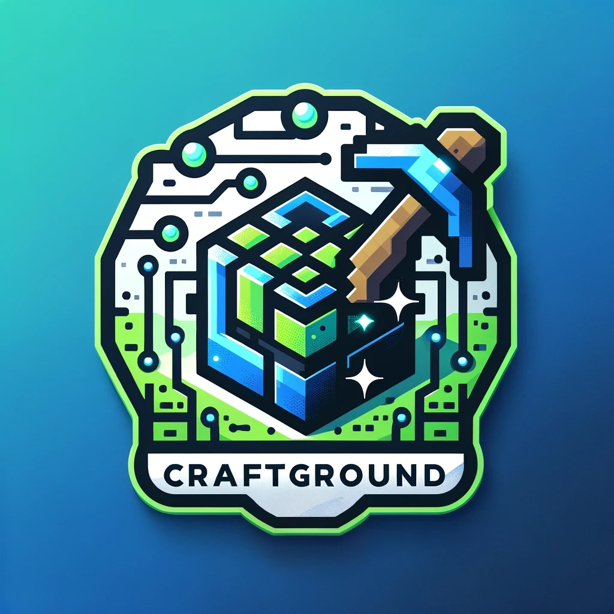

# CraftGround
<a href="https://github.com/yhs0602/CraftGround"></a>

[//]: # (![CraftGround_Logo]&#40;./craftground.webp&#41;)

A **fast**, **up-to-date**, and **feature-rich** Minecraft-based reinforcement learning environment.

## Version


## Install
```shell
pip install git+https://github.com/yhs0602/CraftGround
```

### Dependencies
- JDK 21
- OpenGL
- GLEW
- libpng
- zlib
- cmake

### Conda setup
```shell
sudo apt update
sudo apt install libglew-dev cmake libpng-dev
echo $JAVA_HOME
conda create -n my-experiment python=3.9
conda activate my-experiment
conda install -c conda-forge openjdk=21
conda update -n base -c defaults conda
python -m pip install -r requirements.txt
conda install pytorch torchvision torchaudio pytorch-cuda=11.8 -c pytorch -c nvidia
// if you want to run on headless server, follow the below steps
export PYTHONPATH=.
python my_experiment.py
```

### Conda setup (Headless Server Support, continued from above)
For detailed explanation, refer to [Headless Server Support](https://yhs0602.github.io/CraftGround/headless).
```shell
# To emulate 3D X server, we use VirtualGL.
wget https://sourceforge.net/projects/virtualgl/files/3.1/virtualgl_3.1_amd64.deb/download
mv download vgl3.1.deb
sudo dpkg -i vgl3.1.deb
# Check if you are using wayland session
echo $WAYLAND_DISPLAY
echo $XDG_SESSION_TYPE
ps aux | grep -E 'weston|sway'
# If nothing comes out, proceed with the below steps
sudo vglserver_config
# If you meet the message modprobe: FATAL: Module nvidia_drm is in use.
# You must execute 'modprobe -r nvidia_uvm nvidia_drm nvidia_modeset nvidia'
# with the display manager stopped in order for the new device 
# permission settings to become effective.
# Anyway, continue with the below steps 
# unless you set options to restrict the access to vgluser group, etc..
sudo systemctl restart gdm
# To emulate 2d X server
sudo apt install xvfb
Xvfb :2 -screen 0 1024x768x24 +extension GLX -ac +extension RENDER &
export DISPLAY=:2
VGL_DISPLAY=:0 vglrun /opt/VirtualGL/bin/glxspheres64
# Here you may see that it is still using software rendering, such as llvmpipe
# Then follow the below steps
sudo nvidia-xconfig --query-gpu-info
# Check the BusID of the GPU: Here PCI:104:0:0
sudo nvidia-xconfig -a --allow-empty-initial-configuration --use-display-device=None --virtual=1920x1200 --busid PCI:77:0:0
# Restart the display manager
sudo systemctl restart gdm
# Check if the GPU is used
vglrun /opt/VirtualGL/bin/glxspheres64
# Now it will say something as OpenGL Renderer: NVIDIA GeForce RTX 3090/PCIe/SSE2

# You may have to disable PDMS and screen saver to prevent FPS drop to 1 
export DISPLAY=:0.0
xset -q # Check if the screen saver is disabled
xset s off
xset -dpms # Disable DPMS (Energy Star) features.
xset -q # Check if the screen saver is disabled
```

## Quick Start
See [Integration with Stable Baselines3](https://yhs0602.github.io/CraftGround/integration_sb3) for a quick start guide.

## Features

### Initial Environment

Refer to the below proto for the InitialEnvironment:

```proto
message InitialEnvironmentMessage {
  repeated string initialInventoryCommands = 1;
  repeated int32 initialPosition = 2;
  repeated string initialMobsCommands = 3;
  int32 imageSizeX = 4;
  int32 imageSizeY = 5;
  int64 seed = 6;
  bool allowMobSpawn = 7;
  bool alwaysNight = 8;
  bool alwaysDay = 9;
  string initialWeather = 10;
  bool isWorldFlat = 11;
  int32 visibleSizeX = 12;
  int32 visibleSizeY = 13;
  repeated string initialExtraCommands = 14;
  repeated string killedStatKeys = 15;
  repeated string minedStatKeys = 16;
  repeated string miscStatKeys = 17;
  repeated BlockState initialBlockStates = 18;
  repeated int32 surroundingEntityDistances = 19;
  bool hudHidden = 20;
  int32 render_distance = 21;
  int32 simulation_distance = 22;
  bool biocular = 23;
  float eye_distance = 24;
  repeated string structurePaths = 25;
  bool noWeatherCycle = 26;
  bool no_pov_effect = 27;
  bool noTimeCycle = 28;
  bool request_raycast = 29;
  int32 screen_encoding_mode = 30;
  bool requiresSurroundingBlocks = 31;
}
```

### Observation Space
Includes basic vision rendering, binocular rendering, list of sounds around the agent, agent's status effects, and more. See the proto file for detailed information.

```proto
message ItemStack {
  int32 raw_id = 1;
  string translation_key = 2;
  int32 count = 3;
  int32 durability = 4;
  int32 max_durability = 5;
}

message BlockInfo {
  int32 x = 1;
  int32 y = 2;
  int32 z = 3;
  string translation_key = 4;
}

message EntityInfo {
  string unique_name = 1;
  string translation_key = 2;
  double x = 3;
  double y = 4;
  double z = 5;
  double yaw = 6;
  double pitch = 7;
  double health = 8;
}

message HitResult {
  enum Type {
    MISS = 0;
    BLOCK = 1;
    ENTITY = 2;
  }

  Type type = 1;
  BlockInfo target_block = 2;
  EntityInfo target_entity = 3;
}

message StatusEffect {
  string translation_key = 1;
  int32 duration = 2;
  int32 amplifier = 3;
}

message SoundEntry {
  string translate_key = 1;
  int64 age = 2;
  double x = 3;
  double y = 4;
  double z = 5;
}

message EntitiesWithinDistance {
  repeated EntityInfo entities = 1;
}

message ObservationSpaceMessage {
  bytes image = 1;
  double x = 2;
  double y = 3;
  double z = 4;
  double yaw = 5;
  double pitch = 6;
  double health = 7;
  double food_level = 8;
  double saturation_level = 9;
  bool is_dead = 10;
  repeated ItemStack inventory = 11;
  HitResult raycast_result = 12;
  repeated SoundEntry sound_subtitles = 13;
  repeated StatusEffect status_effects = 14;
  map<string, int32> killed_statistics = 15;
  map<string, int32> mined_statistics = 16;
  map<string, int32> misc_statistics = 17;
  repeated EntityInfo visible_entities = 18;
  map<int32, EntitiesWithinDistance> surrounding_entities = 19;
  bool bobber_thrown = 20;
  int32 experience = 21;
  int64 world_time = 22;
  string last_death_message = 23;
  bytes image_2 = 24;
  repeated BlockInfo surrounding_blocks = 25; // center, (-1, -1, -1), (0, -1, -1), ...; xyz order: len = 27
}
```
### Action Space V1
Similar to Minedojo. (Crafting Not supported)
```proto
message ActionSpaceMessage {
  repeated int32 action = 1;
  repeated string commands = 2;
}
```

### Action Space V2
Similar to MineRL 1.0. Human action space.
```proto
message ActionSpaceMessageV2 {
  // Discrete actions for movement and other commands as bool
  bool attack = 1;
  bool back = 2;
  bool forward = 3;
  bool jump = 4;
  bool left = 5;
  bool right = 6;
  bool sneak = 7;
  bool sprint = 8;
  bool use = 9;
  bool drop = 10;
  bool inventory = 11;

  // Hotbar selection (1-9) as bool
  bool hotbar_1 = 12;
  bool hotbar_2 = 13;
  bool hotbar_3 = 14;
  bool hotbar_4 = 15;
  bool hotbar_5 = 16;
  bool hotbar_6 = 17;
  bool hotbar_7 = 18;
  bool hotbar_8 = 19;
  bool hotbar_9 = 20;

  // Camera movement (pitch and yaw)
  float camera_pitch = 21;
  float camera_yaw = 22;

  repeated string commands = 23;
}
```


## Headless Server Support
Supports headless offscreen rendering using [VirtualGL](https://virtualgl.org/) and [Xvfb](https://www.x.org/releases/X11R7.6/doc/man/man1/Xvfb.1.xhtml).

# Performance
It achieves **~300 TPS** on M1 mac, with screen size 114x64, render distance 5, simulation distance 5, and 1 agent.


## Technical Report
Refer to the [Technical Report](https://yhs0602.github.io/CraftGround/technical_report) for detailed information on CraftGround's internals, optimizations, and more.

# Troubleshooting
## Cannot find glew
```shell
cmake -DOPENGL_opengl_LIBRARY=/usr/lib/x86_64-linux-gnu/libGL.so -DOPENGL_glx_LIBRARY=/usr/lib/x86_64-linux-gnu/libGLX.so -DGLEW_LIBRARY=/usr/lib/x86_64-linux-gnu/libGLEW.so src/main/cpp
```

## Other CMake errors
```shell
rm -rf CMakeFiles
rm CMakeCache.txt
cmake src/main/cpp
```